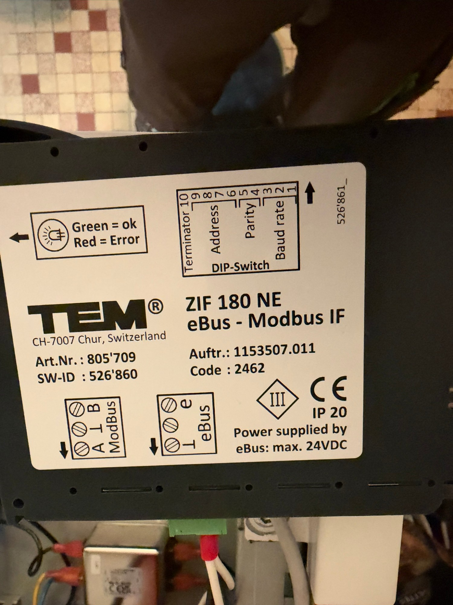
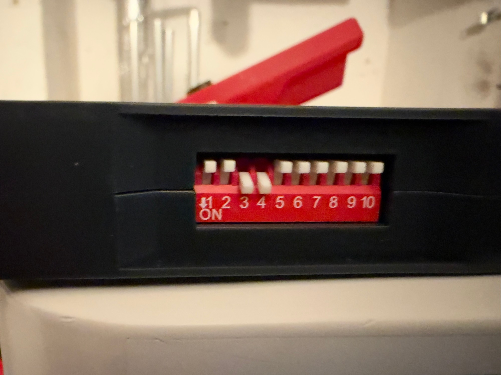
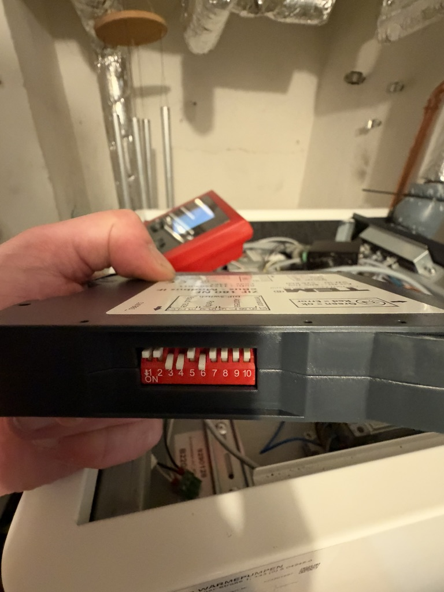
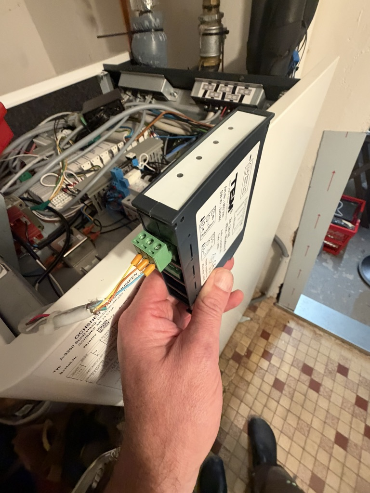
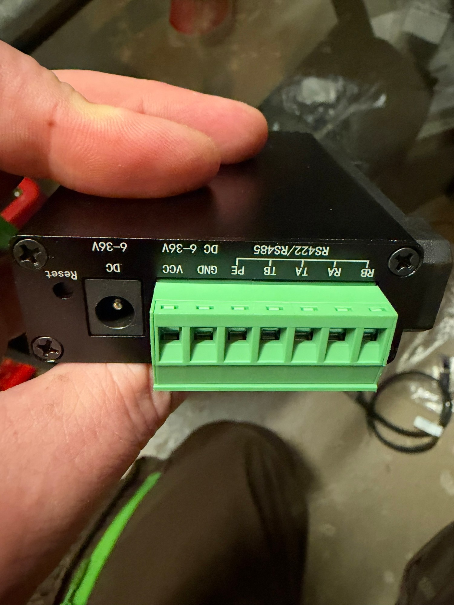
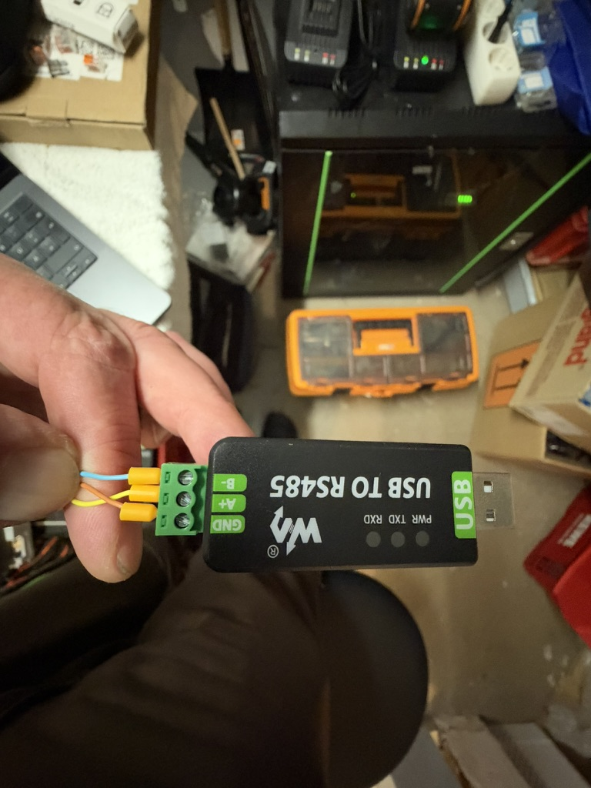
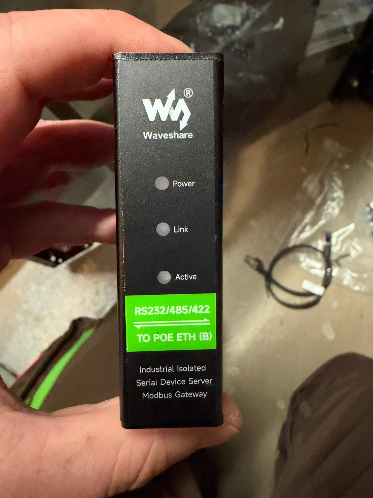
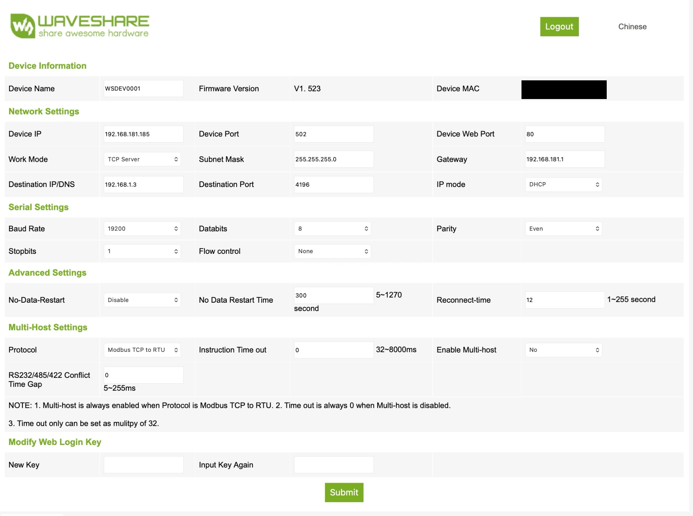

# Hardware Setup Guide

[🇩🇪 Deutsch](HARDWARE_SETUP.md) | 🇬🇧 English

This guide takes you from "I have an OTE Modbus Gateway installed" to "Home Assistant can
read values". All values (IP addresses, Modbus address) in the examples are placeholders –
your own values depend on your DIP switch settings and your network.

## What you need

- An OCHSNER heat pump with an OTE controller and an **OTE Modbus Gateway** (TEM ZIF180)
  already installed – see [README: Is this project for you?](../README.en.md#is-this-project-for-you)
- An RS485 adapter (USB for testing, RS485-to-Ethernet for permanent use – see
  [README: Required hardware](../README.en.md#required-hardware))
- Some time and (ideally) installer/commissioning access, to look inside the electrical
  cabinet and set DIP switches

## Step 1: Locate the gateway and read the DIP switches

The gateway usually sits in the electrical cabinet/indoor unit, on a DIN rail, labeled
"TEM ZIF180" or "eBus-Modbus IF". It has a 10-position DIP switch with the following
layout (also printed directly on the device label):


*The device label: top right the DIP switch legend (Terminator/Address/Parity/Baud rate),
below the terminal assignment for ModBus (A/⊥/B) and eBus.*

| Pins | Function |
|---|---|
| 1–3 | Baud rate |
| 4–5 | Parity |
| 6–9 | Modbus slave address (4-bit) |
| 10 | Bus termination (120Ω) |

**Important:** Take a **sharp, straight-on** photo of the DIP switch position (not at an
angle) – the position is surprisingly easy to misread from a blurry or angled photo. When
in doubt, take several photos from slightly different angles.

### Baud rate (pins 3, 2, 1)

| Pin 3 | Pin 2 | Pin 1 | Baud rate |
|---|---|---|---|
| 0 | 0 | 0 | 1200 |
| 0 | 0 | 1 | 2400 |
| 0 | 1 | 0 | 4800 |
| 0 | 1 | 1 | 9600 |
| 1 | 0 | 0 | 19200 (factory default) |
| 1 | 0 | 1 | 38400 |
| 1 | 1 | 0 | 57600 |
| 1 | 1 | 1 | 115200 |

### Parity (pins 5, 4)

| Pin 5 | Pin 4 | Parity |
|---|---|---|
| 0 | 0 | none |
| 0 | 1 | even – factory default |
| 1 | 1 | odd |

Stop bits follow from this: **1 stop bit with parity enabled, 2 stop bits without
parity.**

### Modbus address (pins 9, 8, 7, 6)

| Pins 9,8,7,6 | Address |
|---|---|
| 0,0,0,0 | **invalid** – not a valid address per the manufacturer's manual! |
| 0,0,0,1 | 11 |
| 0,0,1,0 | 12 |
| ... | ... (sequential) |
| 1,1,1,1 | 25 |

⚠️ **If all four address pins are OFF, the gateway has no valid address.** This is the
factory state before first configuration – you must set at least one of pins 6–9 (e.g. pin
6 → address 11), otherwise the gateway won't respond to any Modbus request, regardless of
whether wiring/software are otherwise correct.

### Bus termination (pin 10)

Only relevant if the gateway is the last/only device on the RS485 bus (typical for a
point-to-point connection to a single RS485 master). 1 = termination resistor enabled.

### Example: reading it correctly vs. incorrectly


*Example of a factory state: pins 3+4 set (baud rate 19200, even parity), but all four
address pins (6–9) OFF – this is an **invalid** address. Aim for a photo this sharp and
straight-on for your own reading.*


*After setting pin 6 to ON: same baud rate/parity as above, but now a valid address (11).*

## ⚠️ Important safety note about DIP switch changes

If you need to change DIP switches: afterwards the gateway may need to be power-cycled
(briefly unplug/replug the eBus terminal) to reliably apply the new setting.

**This is not without consequence:** In a real test installation, unplugging/replugging
the eBus connector on the gateway triggered a fault and put the heat pump into emergency
mode (it ran normally again after reconnecting). OCHSNER's documentation only describes the
case "gateway was never on the bus", not "a previously recognized device suddenly
disappears". Plan DIP switch changes deliberately (not during critical outdoor
temperatures, not routinely) rather than treating it as a "harmless side effect".

## Step 2: Wiring

The gateway has two terminal blocks:
- **ModBus:** labeled `A ⊥ B` (A, ground/shield, B)
- **eBus:** already connected to the heat pump – do not touch this


*The OTE Modbus Gateway's ModBus terminal: A, ground/shield (⊥), B.*

Connect your RS485 adapter with **A→A, B→B**, and if your adapter has a third terminal for
ground/shield, connect it to the gateway's middle terminal (⊥). Per the manual, the Modbus
cable should be twisted and shielded (Cat5/6 cable works well).

When using a **Waveshare RS232/485/422 TO POE ETH (B)** (or a similar device with
RA/RB/TA/TB terminals): use **TA and TB**, not RA/RB – the latter are only relevant for
true 4-wire RS422 operation. The exact pin assignment is in the
[Waveshare wiki, "Hardware Description" section](https://www.waveshare.com/wiki/RS232/485/422_TO_POE_ETH_(B)).


*The rear of the Waveshare adapter: VCC/GND/PE/TB/TA/RA/RB. For RS485 you only need TA
(A) and TB (B), plus optionally PE for the ground/shield reference.*

## Step 3: First connectivity test (USB-RS485)

Before configuring anything in Home Assistant, a plain CLI connectivity test is
recommended, to verify wiring/DIP configuration independently of HA:


*USB-RS485 adapter with labeled terminals B-/A+/GND – easy to read directly off the
device which wire goes where.*

```bash
pip3 install pymodbus pyserial
```

```python
from pymodbus.client import ModbusSerialClient

client = ModbusSerialClient(
    port="/dev/cu.usbserial-XXXX",   # find via `ls /dev/cu.*`
    baudrate=19200,                   # your DIP-switch baud rate
    parity="E",                       # "N"/"E"/"O" depending on DIP switches
    stopbits=1,                       # 1 with parity, 2 without
    bytesize=8,
    timeout=2,
)
client.connect()
# Object 100 "Connection info": Modbus address 257 (decimal, 1-based per OCHSNER's PDF)
# -> pymodbus expects 0-based: 256
result = client.read_holding_registers(address=256, count=1, slave=11)  # your address
print(result.registers[0])  # 1 = eBus connection ok, 0 = no connection
client.close()
```

If this returns `1`: congratulations, your basic configuration is correct.

## Step 4: Production setup via RS485-to-Ethernet gateway

Using the Waveshare RS232/485/422 TO POE ETH (B) as an example:


*The Waveshare RS232/485/422 TO POE ETH (B) – Power/Link/Active LEDs for status.*

1. **Mind the factory IP:** Out of the box, this device does **not** send a DHCP request –
   it has a fixed factory IP (typically `192.168.1.200`, subnet `255.255.255.0`). If your
   network uses a different address range, the device won't be reachable at first – this is
   not a defect. Temporarily add a second IP in the same subnet on your computer (e.g.
   macOS: `sudo ifconfig en0 alias 192.168.1.50 255.255.255.0`), open
   `http://192.168.1.200` in a browser (no password by default), and set "IP mode" to
   "Dynamic" if you'd rather assign a fixed IP via a DHCP reservation on your router.
   Afterwards, remove the alias again (`sudo ifconfig en0 -alias 192.168.1.50`).
2. **Adjust Serial Settings:** Baud rate, parity, and stop bits must exactly match the
   OCHSNER gateway's DIP switch configuration (see Step 1). The Waveshare device's factory
   default (often 115200/None) usually does **not** match the OCHSNER gateway's default
   (19200/Even) – this is one of the most common sources of errors.
3. **Enable Modbus gateway mode:** Under "Multi-Host Settings", set "Protocol" to
   "Modbus TCP to RTU".
4. ⚠️ **Known pitfall:** Waveshare's documentation states that the "Device Port" switches
   automatically to `502` when this option is selected – but this only reliably applies to
   the Windows tool VirCom, **not to the web interface**. Check after saving whether the
   port really is `502`, and set it manually if not.
5. After every change: verify with a connectivity test (see below), don't blindly trust the
   saved settings – this is a known limitation of this device when using the web interface
   instead of VirCom.


*What the configuration page should look like in the end: Device Port 502, Baud Rate
19200, Parity Even, Protocol "Modbus TCP to RTU" (device MAC redacted in this image).*

```python
from pymodbus.client import ModbusTcpClient

client = ModbusTcpClient(host="192.168.x.x", port=502, timeout=3)
client.connect()
result = client.read_holding_registers(address=256, count=1, slave=11)
print(result.registers[0])
client.close()
```

## Firmware note

Current Waveshare devices of this series ship with the latest firmware (e.g. V1.523 at the
time of writing this guide). The manufacturer explicitly warns that **downgrading to an
older firmware is no longer possible** from this version onward (brick risk) – a firmware
update is not necessary for the use case described here.

## Next steps

Once the connectivity test works reliably, the actual Home Assistant integration can be
set up (see the main project README, "Installation" section).
